# Regression on Personal Health Data

## Task

## Table of contents
1. [Components](https://github.com/Ilzira1010/AD_project#Components)
2. [Model Implementation](https://github.com/Ilzira1010/AD_project#model-implementation)
   1. [Import Data](https://github.com/Ilzira1010/AD_project#1-import-data)
   2. [Data Preprocessing](https://github.com/Ilzira1010/AD_project#2-data-preprocessing)
   3. [Exploratory Data Analysis (EDA)](https://github.com/Ilzira1010/AD_project#3-exploratory-data-analysis-eda)
   4. [Model Building](https://github.com/Ilzira1010/AD_project#4-model-building)
   5. [Model Evaluation](https://github.com/Ilzira1010/AD_project#5-model-evaluation)
3. [Conclusion](https://github.com/Ilzira1010/AD_project#Conclusion)
  
## Components
- [Kaggle Dataset](https://www.kaggle.com/mirichoi0218/insurance)
- Jupyter notebook
- Python: numpy, pandas, matplotlib packages

## Model Implementation

### 1. Import Data

Как только мы импортируем данные с помощью read_csv, используйте head() для выборки данных. Мы пытаемся идентифицировать числовые и категориальные данные.

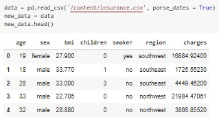

### 2. Data Preprocessing

Нам крупно повезло,потому что в датасете нет "Nan"))))) Давайте посмотрим на наши данные, чтобы что-то понять. Поскольку нас в первую очередь интересует сумма затрат, посмотрим, какие данные больше коррелируют с расходами. Для начала закодируем категориальные признаки.

```python
new_data.isnull().sum()
```

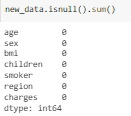

```python
from sklearn.preprocessing import LabelEncoder
#пол
le = LabelEncoder()
le.fit(new_data.sex.drop_duplicates()) 
new_data.sex = le.transform(new_data.sex)
# курящий или нет
le.fit(new_data.smoker.drop_duplicates()) 
new_data.smoker = le.transform(new_data.smoker)
#регион
le.fit(new_data.region.drop_duplicates()) 
new_data.region = le.transform(new_data.region)
```
Несколько слов о кодировке «region». Как правило, категориальные переменные имеют своиство неустоичивости и их лучше всего кодировать с помощью OneHotEncoder и так далее. Но в этом случае ничего не изменится, потому что нет особого порядка, в котором были бы перечислены регионы.


### 3. Exploratory Data Analysis (EDA)
```python
new_data.corr()['charges'].sort_values()
```
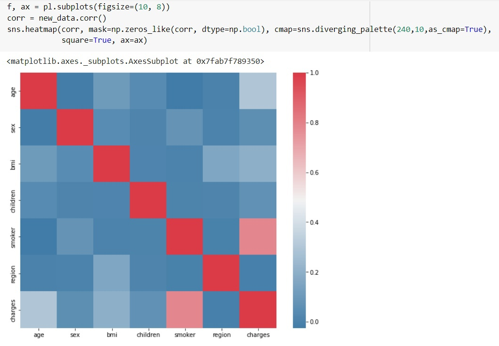

Как мы можем заметить сильная корреляция наблюдается только с фактом курения больного. Мы думали,что высочайшая корреляция будет с BMI(Индекс массы тела). Давайте подробнее рассмотрим курение.

```python
from bokeh.io import output_notebook, show
from bokeh.plotting import figure
output_notebook()
import scipy.special
from bokeh.layouts import gridplot
from bokeh.plotting import figure, show, output_file
from bokeh.layouts import row, column
```
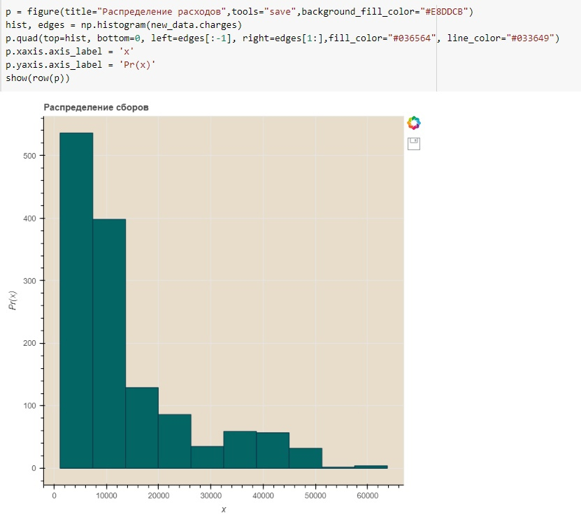
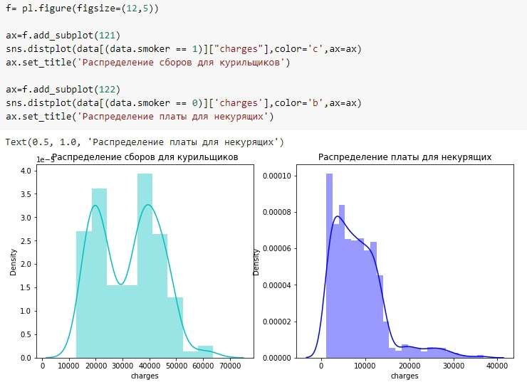

Как мы видим курильщики тратят больше денег на лечение. Но мы все же считаем,что некурящих пациентов больше. Давайте это проверим

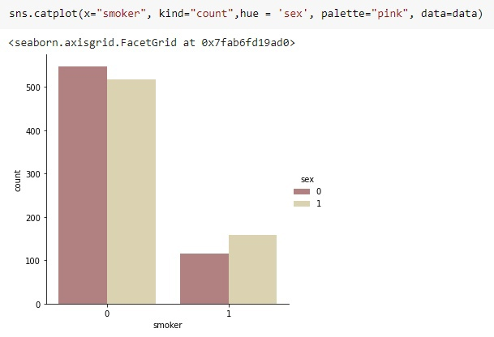


Просим обратить внимание, что женщины кодируются символом "1", а мужчины - "0". При этом некурящих людей и правда больше. Также мы можем заметить, что курящих мужчин больше, чем курящих женщин. Можно предположить, что общая стоимость лечения у мужчин будет больше, чем у женщин, учитывая влияние курения. И еще несколько полезных визуализаций

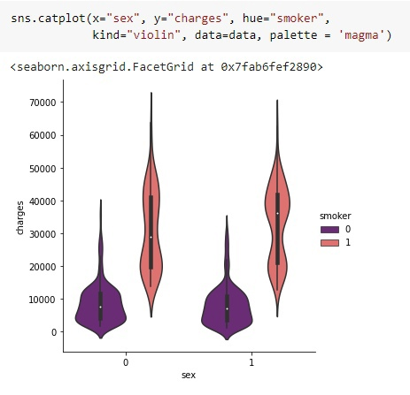
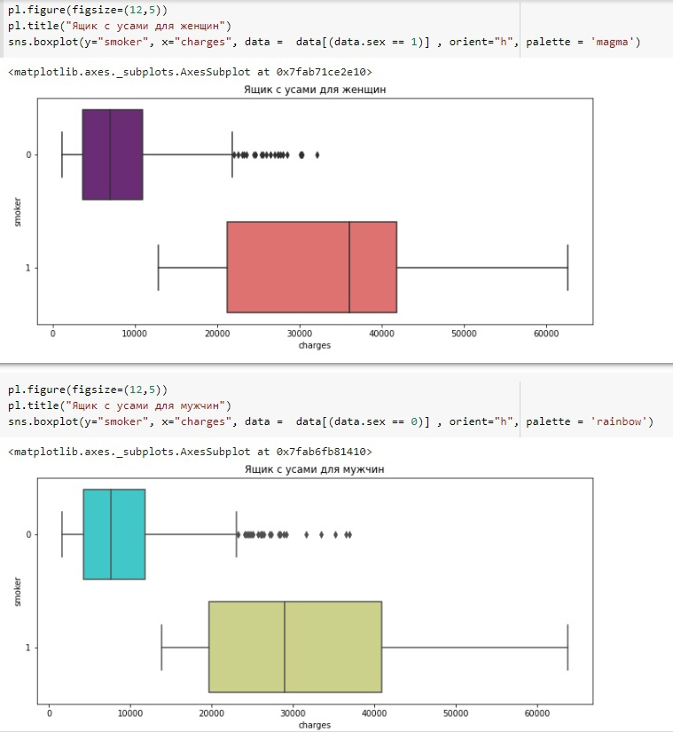

Теперь давайте обратим внимание на возраст пациентов. Во-первых, давайте посмотрим, как возраст влияет на стоимость лечения, а также посмотрим на пациентов, какого возраста больше в нашем наборе данных.

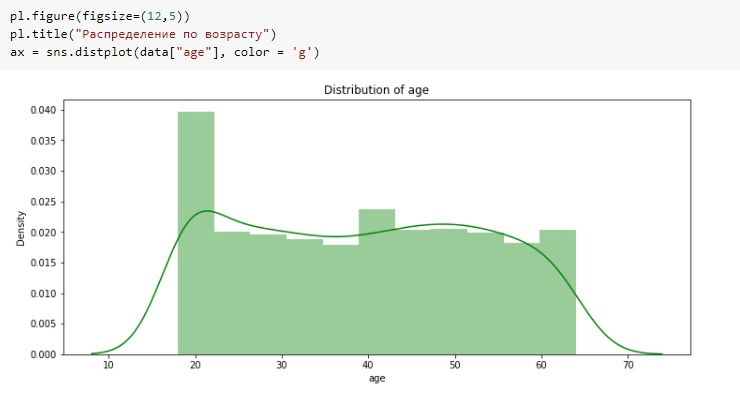

В нашем наборе данных есть пациенты младше 20 лет. Мы взяли за минимальный возраст 18 лет,тк это возраст совершеннолетия и вроде как курение не запрещено..... Максимальный возраст - 64 года. Нас интересует, есть ли курильщики среди пациентов 18 лет.
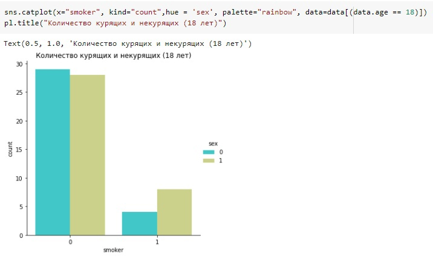

Мдааа.... А мы надеялись, что результат будет другим. Давайте выясним влияет ли курение на стоимость лечения в этом возрасте?

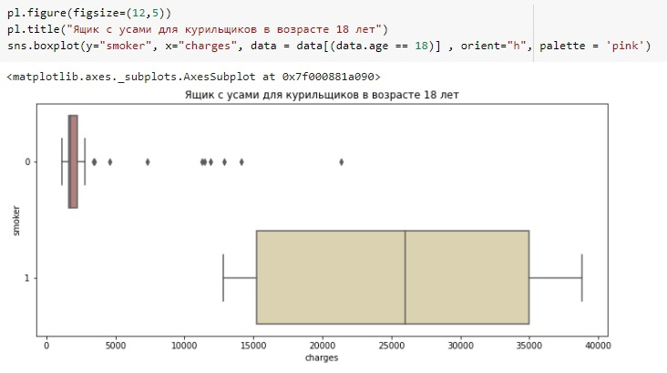

Как мы видим,даже в возрасте 18 лет курильщики тратят на лечение гораздо больше,чем некурящие.Среди некурящих мы наблюдаем некоторые аномалии. Мы предполагаем,что это эти аномалии - это несчастные случаи и серьезные заболевания.Теперь давайте посмотрим, как стоимость лечения зависит от возраста курильщиков и некурящих пациентов.
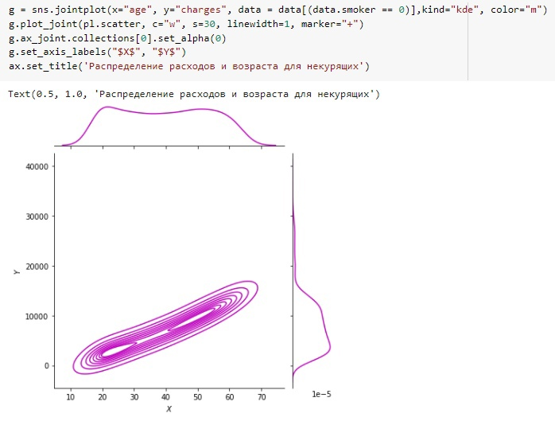
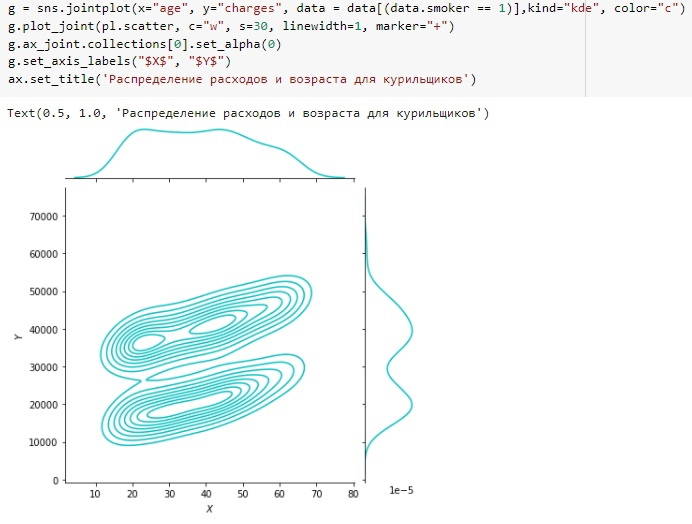
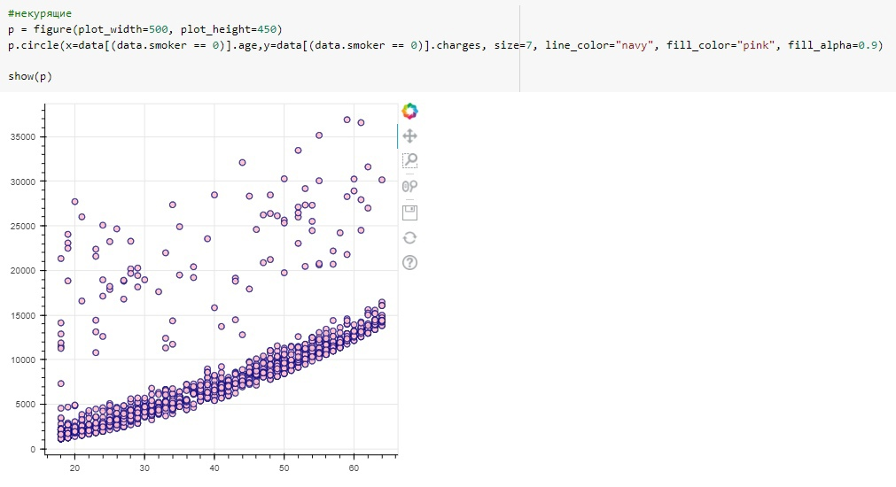
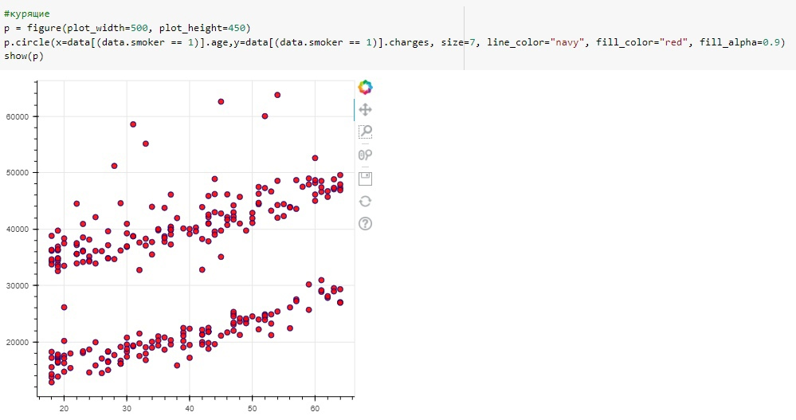
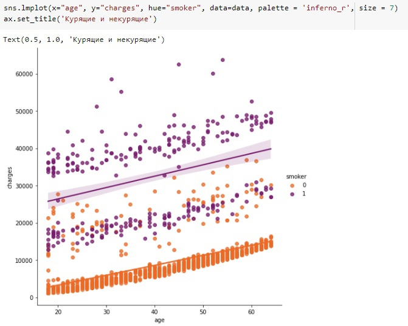

У некурящих стоимость лечения увеличивается с возрастом.Оно и понятно! Так что берегите свое здоровье, друзья! У курящих людей мы не видим такой зависимости. Мы думаем, что дело не только в курении, но и в особенностях набора данных. О таком сильном влиянии курения на стоимость лечения логичнее было бы судить, имея набор данных с большим количеством записей и знаков. Но мы работаем с тем, что у нас есть! Давайте обратим внимание на ИМТ.
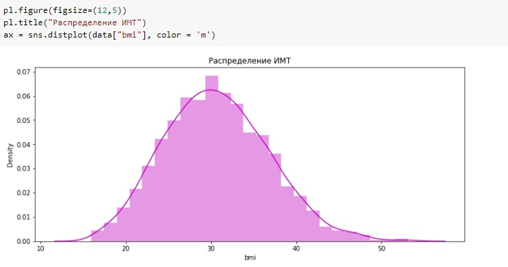

Мы видим очень красивый график. В среднем ИМТ у пациентов из выборки 30. Давайте загуглим этот показатель))))
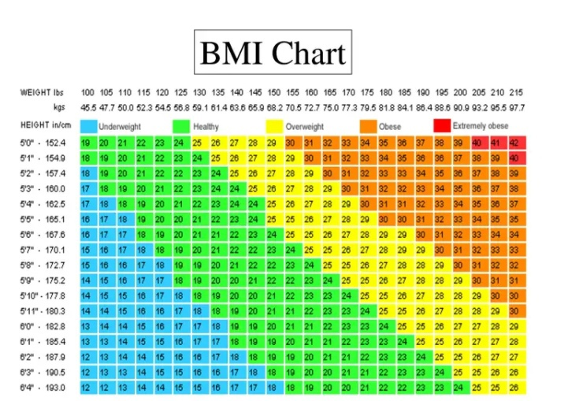

При значении, равном 30, начинается ожирение. Давайте посмотрим на распределение затрат у пациентов с ИМТ более 30 и менее 30.
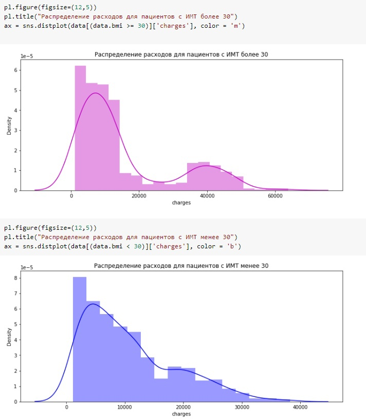

Пациенты с ИМТ выше 30 тратят больше на лечение!
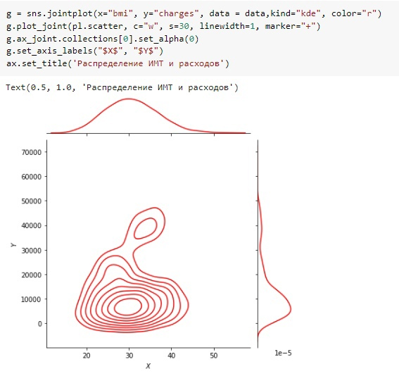
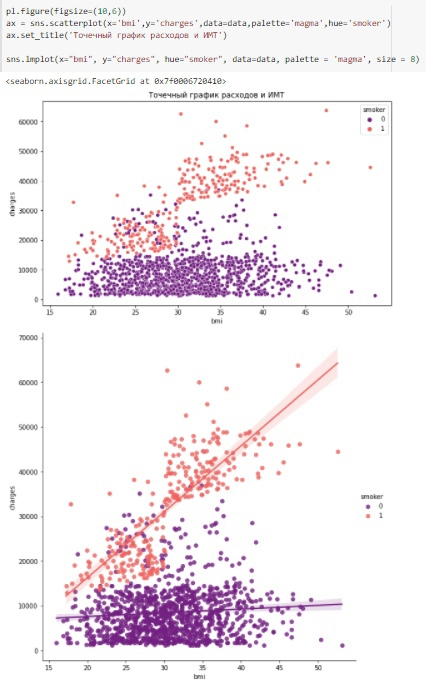

Давайте обратим внимание на детей. Во-первых, давайте посмотрим, сколько детей у наших пациентов.
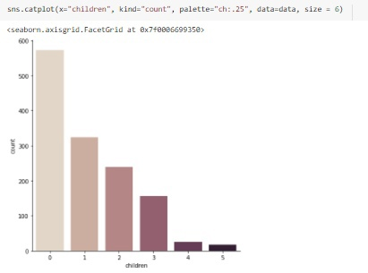

У большинства пациентов нет детей. Интересно, курят ли люди, у которых есть дети?
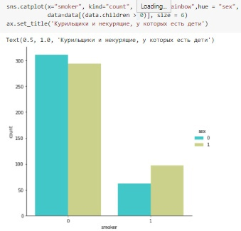

Мы рады, что некурящих родителей гораздо больше!

Теперь мы собираемся спрогнозировать стоимость лечения. Давайте начнем с обычной линейной регрессии.

### 4. Model Building
```python
from sklearn.linear_model import LinearRegression
from sklearn.model_selection import train_test_split
from sklearn.preprocessing import PolynomialFeatures
from sklearn.metrics import r2_score,mean_squared_error
from sklearn.ensemble import RandomForestRegressor
x = data.drop(['charges'], axis = 1)
y = data.charges

x_train,x_test,y_train,y_test = train_test_split(x,y, random_state = 0)
lr = LinearRegression().fit(x_train,y_train)

y_train_pred = lr.predict(x_train)
y_test_pred = lr.predict(x_test)

print(lr.score(x_test,y_test))
```
```python
0.7962732059725786
```
Неплохо.... Теперь давайте добавим полиномиальные знаки. И посмотрите на результат.
```python
X = data.drop(['charges','region'], axis = 1)
Y = data.charges

quad = PolynomialFeatures (degree = 2)
x_quad = quad.fit_transform(X)

X_train,X_test,Y_train,Y_test = train_test_split(x_quad,Y, random_state = 0)

plr = LinearRegression().fit(X_train,Y_train)

Y_train_pred = plr.predict(X_train)
Y_test_pred = plr.predict(X_test)

print(plr.score(X_test,Y_test))
```
```python
0.8849197344147228
```
Хорошо!Наша модель хорошо прогнозирует стоимость лечения пациентов. И, наконец, попробуем RandomForestRegressor.

### 5. Model Evaluation

```python
forest = RandomForestRegressor(n_estimators = 100,
                              criterion = 'mse',
                              random_state = 1,
                              n_jobs = -1)
forest.fit(x_train,y_train)
forest_train_pred = forest.predict(x_train)
forest_test_pred = forest.predict(x_test)

print('MSE train data: %.3f, MSE test data: %.3f' % (
mean_squared_error(y_train,forest_train_pred),
mean_squared_error(y_test,forest_test_pred)))
print('R2 train data: %.3f, R2 test data: %.3f' % (
r2_score(y_train,forest_train_pred),
r2_score(y_test,forest_test_pred)))
```
```python
MSE train data: 3729086.094, MSE test data: 19933823.142
R2 train data: 0.974, R2 test data: 0.873
```
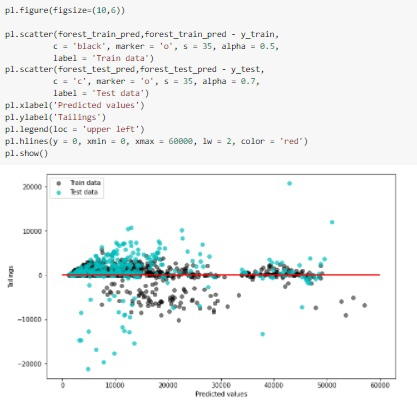
## Conclusion
Хороший результат. Но мы видим заметную переподготовку алгоритма на обучающих данных.

Всем спасибо за внимание!
